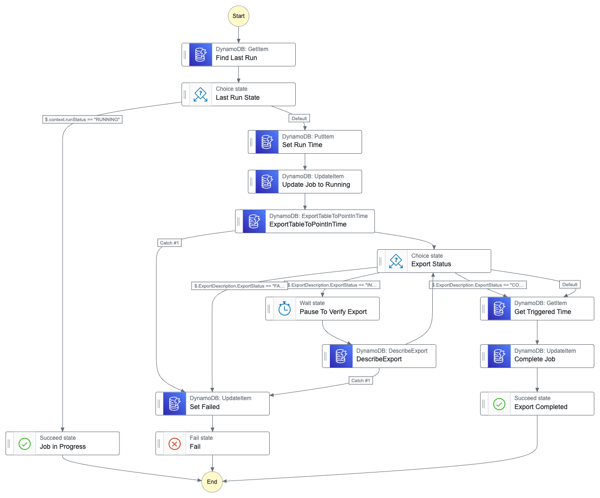

# DynamoDB Incremental Export with Step Functions

Purpose: Working example of using AWS Step Functions to perform and manage a DynamoDB Incremental export process

## Getting Started

### Deploying

First off, install [Node.js](https://nodejs.org/en)

```bash
# install AWS CDK
npm install -g aws-cdk
# clone the repository
cd dynamodb-incremental-export-sf
npm install
```

Once dependencies have been installed, you are ready to run CDK

```bash
cdk deploy
```

## Destroying

Simply run:

```bash
cdk destroy
```

## Implementation

For a further and in-depth review of how to use this repository and what it supports, head on over the [Blog Article](https://binaryheap.com) <Article not complete but under construction>

## State Machine


